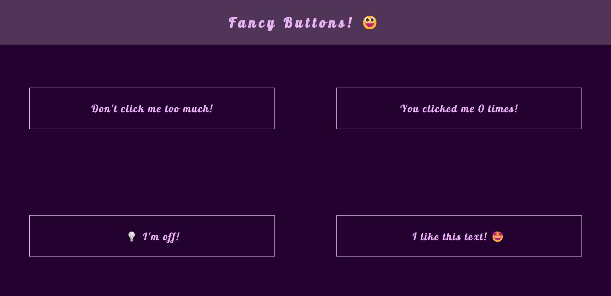

# Fancy Buttons 

Fancy Buttons is a simple React app that showcases dynamic styling and interactive buttons:
- Angry Button
- Counter Button
- Light Switch Button
- Text Repeater Button

## Final Product

**Video of functionality:**

<video src="https://user-images.githubusercontent.com/109990289/f3715e97-6c41-4818-b7c1-cb23cbfd7dfa.mp4" controls="controls" muted="muted" class="d-block rounded-bottom-2 width-fit" style="max-height:640px;">
</video>

**Screenshot:**

## Purpose

This project was created by [me](https://github.com/kazvee) as part of my learnings at [Lighthouse Labs](https://www.lighthouselabs.ca/en/web-development-flex-program).

## A note about `create-react-app`

For larger, production-ready applications, React's official documentation and best practices now recommend other ways to [Start a New React Project](https://react.dev/learn/start-a-new-react-project)

As this was a small project to further explore React's core concepts and principles, with no plans to scale it up or customise it further, it's been bootstrapped with [Create React App](https://github.com/facebook/create-react-app) which still provides a straightforward way to quickly spin up a functional React app for learning purposes.

## Getting Started

- Fork this repository to your own GitHub account.
- Clone your fork onto your local device.
- Install all dependencies using the `npm i` (or `npm install`) command.
- Start the web server using the `npm start` command. The app will be served at [http://localhost:3000](http://localhost:3000/).
- Navigate to [http://localhost:3000](http://localhost:3000/) in your browser.
- Start clicking some buttons! 😃
